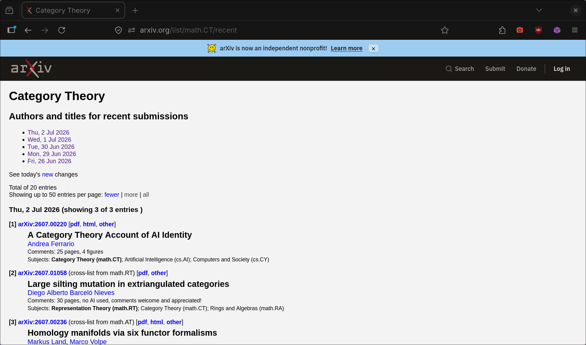
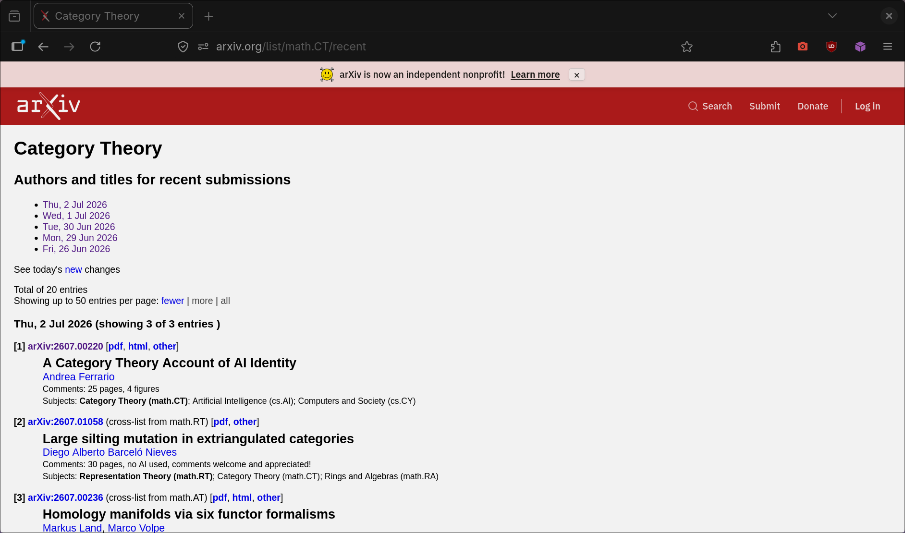

# arXiv Red

arXiv's 2026 redesign replaced the classic red banner with a blue one. This restores the red banner and logo on arxiv.org.

| Before | After |
| --- | --- |
|  |  |

## Install

Install one of these, not both.

**Stylus** (Firefox/Chrome): install the [Stylus extension](https://github.com/openstyles/stylus), then click [arxiv-red.user.css](https://raw.githubusercontent.com/greysonbowser/arxiv-red/main/arxiv-red.user.css) and confirm the install prompt.

**Tampermonkey**: install the [Tampermonkey extension](https://www.tampermonkey.net/), then click [arxiv-red.user.js](https://raw.githubusercontent.com/greysonbowser/arxiv-red/main/arxiv-red.user.js) and confirm the install prompt.

## Notes

This is an unofficial arXiv theme tweak. It does not collect data, add analytics, nor change page behavior beyond the header colors and logo.
